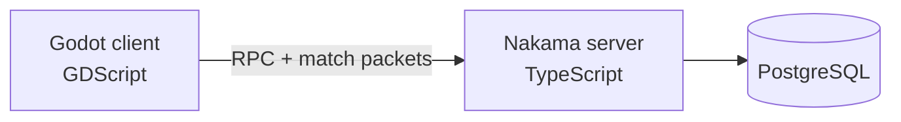

Pixiverse is a multiplayer productivity mobile RPG that I've been building since February. You create real life tasks, place your character in shared spaces, start a timer, and you get XP that levels up your RPG stats. It runs on a stack consisting of Godot on the frontend, TypeScript Nakama on the backend, and connecting PostgreSQL. This devlog is about what actually happens when you finish a task, and the frustrating bugs that made me understand why it has to be built this way.


_Lock in: a push up session running in Pixiverse_

### Why I Built It

Not gonna lie, the idea came pretty randomly. I was on vacation, reading some books and trying hard not to think about starting an app. And then I thought: what if we could actually see our improvements? Like when I finish a book and my INT stat goes up a bit. A game HUD for real life, it would definitely look cool right?

At first I just wanted to build the task list and the stats. My friend (we're building this together) talked me out of it. She said a self improvement task list alone is just another to do app, there's so many of those already. What makes this one worth building is the social side. You and your friends are in the same room, you keep streaks together, you see someone else focusing at 2am and suddenly you don't feel like the only one grinding. So we made it bigger: shared world, chat, friends list, and a pet.

We're aiming at people like us, roughly 16 to 25, who want to improve themselves. Tbh I have really bad attention span and a visible timer plus a streak works way better on me than discipline ever did.

Before any code I made a Moodboard and a pile of wireframes. Profile, chat, a hexagon for the stats, study room, task creation. Most of those screens are in the game now almost exactly like I drew them.


_Look at how messy this looks... Ngl tho it was really fun looking at all these art and UI designs_

### The Gameplay

The loop is very simple. You create a task, you go do the real thing, you earn progression, you see your friends doing their stuff, repeat. A task has a category, which corresponds to its stats: INT, STR, VIT, WIS, CRA, a difficulty, and a completion type. We have three types: check in (for very trivial chores, you did the thing and you just tap to confirm), stopwatch (for task that does not have fixed time, so you focus and grind as long as you want), and timer (for hard task that you want to force yourself, you commit to N minutes for that task). In the game, you walk your character to a workstation, could be a office chair, a treadmill, a gym bench, depending where you are, the session runs, and when it ends the server pays out XP.


_Bob and I and Picky are just vibing_

Honestly, the room part matters more than I expected. You could see other players walking around, their activity label, their progress ring filling up. Daily quests pull you back every day. And Picky, our pet. It's a small chicken, it's our own IP and we drew all of it ourselves. It follows you around and evolves: rolling egg at the start, cracked shell at level 8, adult at 15. We wanted progression you can point at, not just a number on your profile.

{: style="width: 60%" .d-block .mx-auto}
_There are quite some customizations to this_

### The Setup

There are three components:



The client renders the world and runs the session UI but it never decides rewards. Nakama runs the multiplayer rooms and all the RPCs: task CRUD, session completion and rewards, friends, chat, the cosmetic store. Everything persistent lives in PostgreSQL through Nakama storage and only the server writes there.

This was the biggest tradeoff. The client could calculate XP by itself: instant reward screen, works offline, way less backend code. But progression IS the game, and if the client decides the XP then one patched build means infinite XP. As a security individual I'm definitely not letting that happen lol, this is why every session completion will be verified by the server, and everything below exists because of that.

### What Happens When You Finish A Session

So, completing a task. When the session ends, the client fires one small JSON packet at the server. Here's a real one I grabbed from a test session:

```json
{
  "category": "Fitness",
  "client_session_id": "[a-bunch-of-numbers]",
  "completion_type": "timer",
  "difficulty": "Trivial",
  "duration_seconds": 1500,
  "end_reason": "auto",
  "ended_at": 1789527902,
  "local_date": "2026-09-15",
  "started_at": 1789526402,
  "task_id": "[more-bunch-of-numbers]",
  "task_name": "10 push ups"
}
```

That's the whole request. The client_session_id is just a random id the client mints when the session starts, it matters later. The server's job is to turn this packet into XP exactly once. No matter what happens.

Before the server gives you the xp, it checks a lot of stuff. Are the timestamps, is started_at not in the future, is ended_at at most 60 seconds in the future (phones have weird clocks). Then the important one: category, completion type and duration all come from the task stored on the server, not from the request. The xp math itself (per minute rate, streak multiplier, daily caps) is also server side and everything gets clamped there, so there is no version of this where a modified request gets you more xp.

The part that took me longest to get right is the write. One completion touches 4 records: the task itself, the daily limits, the progression and the session logs. Nakama storage writes are version-checked, which is optimistic concurrency control: a write only lands if the version you read is still the current one. The flow goes like this: read all 4 records, process calculations, write all 4 records and update their versions.

So what happens if you're working on two devices at the same time? Both read the same version of the records, both calculate their new xp, both try to write. The first write lands. The second still expects the old version, so it gets rejected. It re-reads the updated state of the record, adds its xp on top of what the first device just wrote, and writes again. Therefore nothing overwrites anything, the updates end up applied one after another.

And what if the same request arrives twice? Here's how that happens. The timer ends, the app fires the request, and at that exact moment your internet drops. Now two things could be true: the request never reached the server, or it reached the server but the response never made it back to your phone. From the app's side they look identical, it just knows it never got a confirmed answer. So solution: it saves a snapshot of the session to disk (task, timestamps, client_session_id), and once you're back online it rebuilds the request and sends it again. If the attempt before disconnected never landed, that's just the normal completion. If it did land, this request is a duplicate. For that the server keeps a list of the last 20 session ids it has already rewarded:

```ts
// recent_session_ids = the last 20 session ids that already got rewarded
// this line checks whether the session is in the rewarded list
if (
  req.client_session_id &&
  (sessionLog.recent_session_ids || []).indexOf(req.client_session_id) !== -1
) {
  // rejecting rewarded sessions
  return { rejected: { ok: false, error: "duplicate_session" } };
}
```

Oh, and the client treats already_completed_today as success with 0 XP. You still get your completion screen, it just doesn't give you any progress.

### Clunky to Smooth Movements For Multiplayer

The other frustrating thing: remote players. The server broadcasts everyone's position as tiny snapshots 10 times a second, and my first idea was to just snap remote avatars to whatever tile the latest snapshot says. It gives correct positions, but feels terrible. With any lag the avatar teleports tile by tile and walking looks like stop motion. I even tried changing the poll rate, but being too accurate actually makes the movement feels clunky as well. The fix was to stop trusting single snapshots: the client keeps a list of the recent snapshots, and every frame it smoothly interpolates the avatar between them. A full state sync every few seconds to recover anything in case too many got dropped. This rewrite also fixed remote players getting stuck inside a table when they stood up, which was as dumb as it sounds.

What does "interpolate" mean here? The server only tells you where a player is at specific moments: position A at time 1.0, position B at time 1.1. In between, nobody knows the truth. But players walk in straight lines, so this would work: draw the line from A to B and place the avatar on it, as far along as the time. With this, walking stays smooth even when the network is unstable, and a stop or a turn is just another snapshot in the list a tenth of a second later, so the avatar eases into the new direction instead of teleporting.

There's a small tradeoff here, that is remote players are always a bit late (around 120ms). It's fine though, this is a productivity app, not an FPS game or real time combat. I rather have avatars arriving late that not many would notice than janky movements.

### What I Learned And What's Next

Looking back, the biggest thing this project gave me is a glimpse of what real shipping looks like, end to end. And the timing is interesting: a lot of this codebase was written by coding agents, and at some point reviewing every line by hand stopped being realistic. So the real work became managing the workflow: deciding what gets built, which agent does what, and how to verify the result. I think that's what software engineering is now anyway. Not just writing code, but system design, architecture, defining the right features, designing the user experience, and making the tradeoff calls (the two examples above were exactly that, both had real costs). Plus all the glue nobody puts on a poster: cloud infrastructure, deployments, staging environments.

Right now a small group of alpha testers is playing the game. The next step is the full public launch, launch video and all, and after that it's talking to users, user feedback, marketing, more features, and scaling the product. I've learned a lot building this and I'll keep updating the journey here.

If you want to see it, the site is at [pixiverse.app](https://pixiverse.app). It's basically another showcase of the app, but the design is cool, go check it out.
