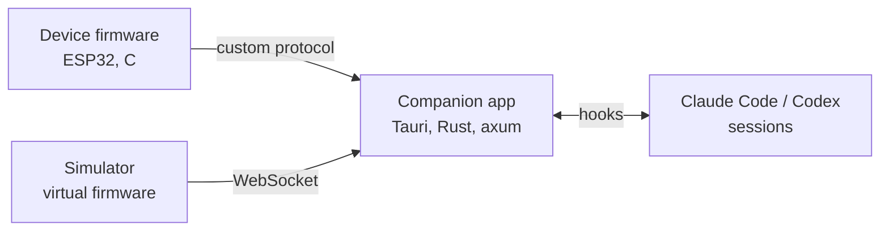

### How this all started ...

This one starts with the launch of Codex Micro. It's a deeply integrated macropad for Codex at two hundred something dollars, honestly I was pretty close to buying it. Two things stopped me. It only talks to the Chatgpt app, and I don't live in one tool. Usually I've got Claude Code, Codex, and maybe some other harnesses, and what I actually want is one good interface for all of them. And the biggest turn off: it has no microphone, which is fine on a laptop but I run a Mac Mini as well, my current workflow is a Dji mic mini paired to a desktop, which is pretty annoying since I always had to turn it on and off and re-pair it. A device like this should just have one, the way a keyboard has keys lol. (I was also deep in a keyboard rabbit hole at the time, so hot-swap sockets had unfair appeal)

So I'm decided to build Jonsole: a smooth 3x5-sized console with hot-swap keys, a display, a joystick, a rotary encoder, RGB and a mic for push-to-talk, wired into whatever agent harness you're running. I started at the end of July, and I'm writing this while it's still half-baked, because a lot of the interesting parts happened in the hardware.


_The current 3D model of jonsole, subject to change_

### The Structure

The structure has three core pieces:



The firmware is C on ESP-IDF and FreeRTOS. Its job is physical input in, protocol messages out: it reads the switches and joystick, drives the display, and translates all of it into our custom protocol for the companion app (which is just JSON messages encoded with COBS), with a handshake and pings every 5 seconds. It also announces its components (keys, joystick, display, microphone) so the app builds its interface from that.

The companion app is what everything plugs into. It's a small Rust app built on Tauri that lives in the menu bar tray. It keeps track of your agent sessions, which ones are running and which ones are waiting for you, and it routes a key press to the right one. Unplug the device and it quietly reconnects when you plug it back in.

And because we don't have the hardware yet, we also built a simulator: a virtual firmware that speaks the same protocol over a WebSocket. It's the reason the companion app already exists, the app got built and tested against the simulator while the device is still in parts. The protocol is documented in the repo, and the C firmware, the simulator and the Rust host are all written against that same document, else CI will fail.

### Hooking Into The Agents

The integration with Claude Code (or most agents to be build in the future) runs through hooks. On install, the companion app writes hook entries into `~/.claude/settings.json` for a set of events. When Claude Code fires one, it gets forwarded to the app's local server as JSON:

```json
{
  "session_id": "…",
  "hook_event_name": "PermissionRequest",
  "cwd": "/Users/kata/pixiverse",
  "tool_name": "Bash",
  "tool_input": { "command": "cargo test" }
}
```

The app turns that request into a row in the session list: which project it came from, what it's waiting for. Permission requests are the special one, because Claude Code blocks the tool call while the hook is pending, so the app can hold the request open for a while and let you answer it from somewhere else, like a key on the device. Every other event just updates the session's state, running, waiting, done, that's the baseline. And if the app is closed, nothing blocks.


_Companion app received the permission request from Claude Code's hook!_

### First Prototype

The first prototype is exactly what it sounds like: a breadboard, wires, an ESP32 kit and an microphone module. It was my first time soldering too, so the mic's header pins went on slowly, with a lot of re-checking. After some debugging, the mic worked, and honestly it works surprisingly well for a part that costs about a few bucks.

Before committing to a PCB there was one thing I genuinely didn't know: whether one cheap chip could do Bluetooth hands-free audio and keyboard at the same time. The breadboard settles it: one ESP32, one pairing, advertising as both, macOS taking both without complaining. It just works.

After this I bought a few more components, and that's the full breadboard in the photo below. I did not breadboard with all the components, for example, the missing rotary encoder and the keyboard switches. This was because that I ordered the components with the PCB together, shipping from China.


_It has so many wires lol_

That mic did something to how I look at gadgets now. The margin between raw material and what finished products charge is way bigger than I assumed: a few dollars mic, a twenty dollar devkit, in a product category that could go up to hundreds. It's obviously not that simple: enclosures, assembly, firmware and software all cost a lot of effort and money. But once you've priced the raw parts yourself, the listing price just reads differently.

### The Schematic

Then the real project: turning the breadboard into an actual board. I had never opened KiCad before this.

I split it into four sheets: power, mcu, controls, ui. The power sheet is the one I underestimated: USB-C in with input protection, a proper charging path for the battery, and two separate 3.3V rails, one for logic and one for the LEDs with its own switch, so the lighting can be turned off without touching anything else. The rest is what you'd expect: the ESP32, the hot-swap sockets and joystick, the OLED and encoder.


_This is why we needed more than 1 sheet..._

The schematic went through a bunch of iterations, audited back and forth by multiple agents, until ERC came back clean. To me the AI(s) did pretty much most of these is actually very impressive: it read datasheets, chose parts and symbols, and made sure everything is wired up and tidy. Obviously nothing is proven until I actually assemble the PCB. But still it did a pretty great job here. The only caveat is that the sheets are pretty unreadble. So I had to refer to Phil's labs tutorial and fix it up myself.

### Routing Everything By Hand

The layout is where I spent most time of the project, and where AI kept letting me down. I kept trying to get agents to do the placements and routing, and it kept failing while burning through my tokens. The board file is serialized drawing objects, so an agent can't see what it drew, and without a really good interface to work in, it doesn't understand spacing. People were glazing GPT-6 Astra on being able to do PCBs, but my verdict after all of it: it can't complete the job yet, and I'm saying that as a beginner myself.

I tried the autorouter too, same story from a different angle: it completes routes, and it doesn't know the constraints, so its output went in the trash.

So I routed everything by hand. The rules I actually followed, learned people that are smarter than me online: give the power routes a wider width, keep a uniform width for everything else, keep one layer as a mostly continuous ground, don't cut the ground plane up more than you have to, and keep signals that can interfere separated so you don't get crosstalk. None of it is very complicated, but all of it has to be followed, trace by trace.

To avoid being overwhelmed by all those placements and routing, I have built a checklist, around 20 numbered circuits in dependency order, local power and capacitor loops first, then USB, then the mic group, then LEDs, then display and buttons. Ground pours on both layers, stitching vias, re-running DRC and staring at the report. About two weeks in, I'm actually done!


_This just took me a couple nights!_

### What I Learned And Then?

The routing part was the best of the project so far, which I did not expect to say. I now know why a basic board looks the way it looks, and why the ground plane is sacred. I learned a lot and actually had to review a bit of high school physics and very basic circuit and power electricity stuff to get through it. Building the whole thing end to end and stepping toward making an actual product just feels good.

The end goal for Jonsole is a Kickstarter, and hopefully this thing can be done very soon. All the components and tools are coming in, so the next stretch is mostly waiting for parts, followed by a lot of first-time assembly, which is equal parts exciting and terrifying. Meanwhile the companion app keeps getting new features, and the next big one is deep integration with Codex, so the device can end up being the one control surface across Claude Code and the ChatGPT app. Yeah, that's it I guess.
